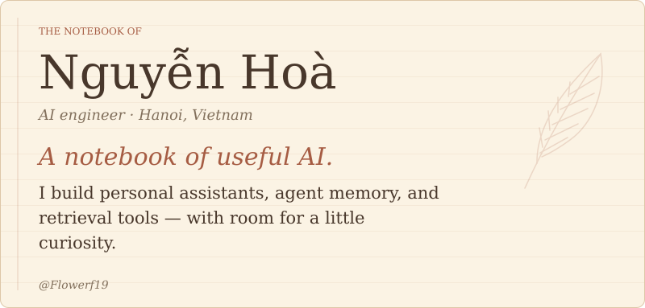
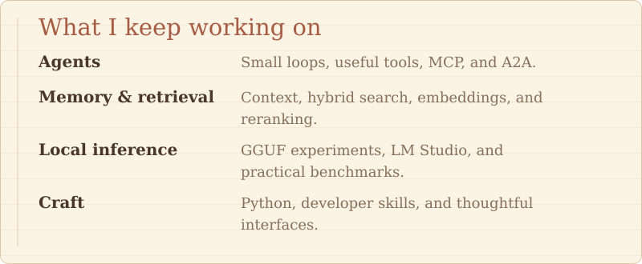
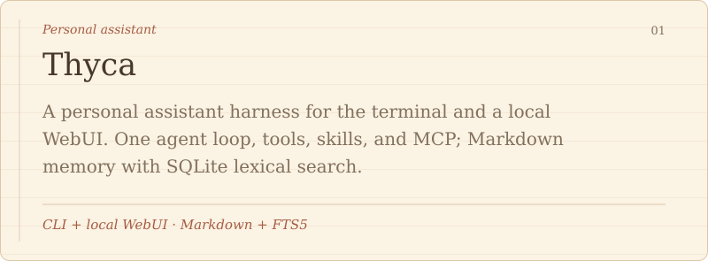
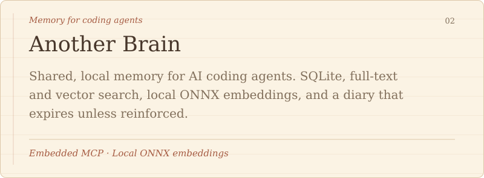
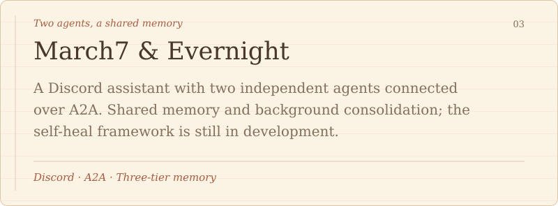
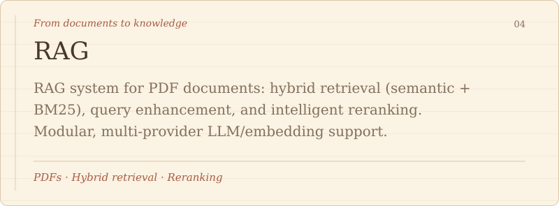
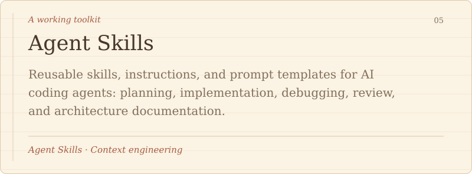

<!-- Generated from README.template.md and profile.json; run python scripts/generate_readme.py. -->

<picture>
  <source media="(max-width: 600px)" srcset="./assets/gen/cover-mobile.svg">
  
</picture>

<picture>
  <source media="(max-width: 600px)" srcset="./assets/gen/focus-mobile.svg">
  
</picture>

<picture>
  <source media="(max-width: 600px)" srcset="./assets/gen/projects-heading-mobile.svg">
  
</picture>

<a href="https://github.com/Flowerf19/thyca-ai">
<picture>
  <source media="(max-width: 600px)" srcset="./assets/gen/project-thyca-ai-mobile.svg">
  
</picture>
</a>

<a href="https://github.com/Flowerf19/another-brain">
<picture>
  <source media="(max-width: 600px)" srcset="./assets/gen/project-another-brain-mobile.svg">
  
</picture>
</a>

<a href="https://github.com/Flowerf19/March7">
<picture>
  <source media="(max-width: 600px)" srcset="./assets/gen/project-march7-mobile.svg">
  
</picture>
</a>

<a href="https://github.com/Flowerf19/RAG">
<picture>
  <source media="(max-width: 600px)" srcset="./assets/gen/project-rag-mobile.svg">
  
</picture>
</a>

<a href="https://github.com/Flowerf19/agents-skills">
<picture>
  <source media="(max-width: 600px)" srcset="./assets/gen/project-agents-skills-mobile.svg">
  
</picture>
</a>

<picture>
  <source media="(max-width: 600px)" srcset="./assets/gen/contact-heading-mobile.svg">
  
</picture>

<a href="https://linkedin.com/in/nguy%E1%BB%85n-ho%C3%A0-b67a15409">LinkedIn</a> &nbsp; · &nbsp; <a href="https://www.facebook.com/hoaf.n.v">Facebook</a> <a href="mailto:Flowerf19th5@gmail.com">Flowerf19th5@gmail.com</a> &nbsp; · &nbsp; <a href="mailto:hoaf.n.v@gmail.com">hoaf.n.v@gmail.com</a>

Read the notebook as text

### Nguyễn Hoà · AI engineer

I build personal assistants, agent memory, and retrieval tools — with room for a little curiosity.

### Areas of work

- **Agents:** Small loops, useful tools, MCP, and A2A.

- **Memory & retrieval:** Context, hybrid search, embeddings, and reranking.

- **Local inference:** GGUF experiments, LM Studio, and practical benchmarks.

- **Craft:** Python, developer skills, and thoughtful interfaces.

### Selected projects

- **[Thyca](https://github.com/Flowerf19/thyca-ai):** A personal assistant harness for the terminal and a local WebUI. One agent loop, tools, skills, and MCP; Markdown memory with SQLite lexical search.

- **[Another Brain](https://github.com/Flowerf19/another-brain):** Shared, local memory for AI coding agents. SQLite, full-text and vector search, local ONNX embeddings, and a diary that expires unless reinforced.

- **[March7 & Evernight](https://github.com/Flowerf19/March7):** A Discord assistant with two independent agents connected over A2A. Shared memory and background consolidation; the self-heal framework is still in development.

- **[RAG](https://github.com/Flowerf19/RAG):** RAG system for PDF documents: hybrid retrieval (semantic + BM25), query enhancement, and intelligent reranking. Modular, multi-provider LLM/embedding support.

- **[Agent Skills](https://github.com/Flowerf19/agents-skills):** Reusable skills, instructions, and prompt templates for AI coding agents: planning, implementation, debugging, review, and architecture documentation.

